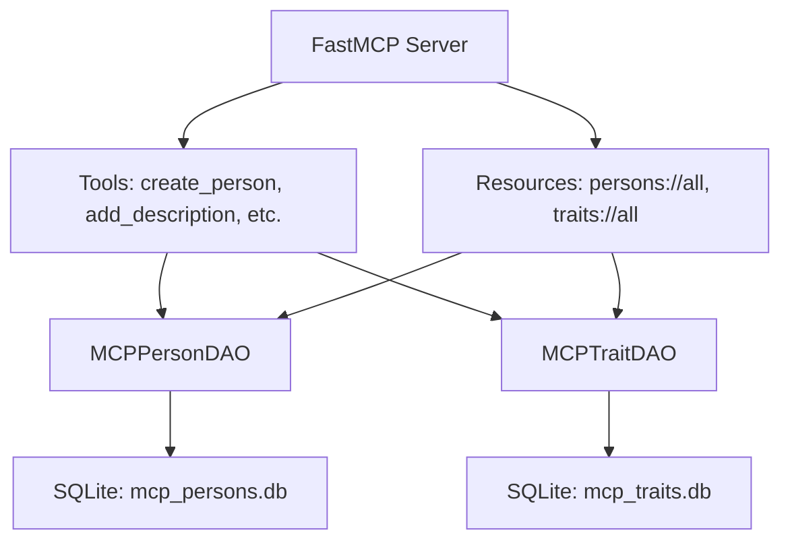

# MCP Traits Matcher

## Description

A personality analysis server built using the FastMCP framework. It provides tools and resources for personality analysis and matching. The system analyzes personality traits based on friendliness and dominance scores, allowing you to create persons, define traits, and find matches for job descriptions.

## Architecture Overview

The application consists of several key components:

- **FastMCP Server**: Handles HTTP requests and provides MCP protocol endpoints
- **Data Access Objects (DAOs)**: Manage database interactions for persons and traits
- **Pydantic Models**: Define data structures and validation
- **Tools and Resources**: Expose functionality through MCP endpoints



## Features

*   Creates persons and traits with personality scores
*   Adds descriptions to persons, updating their personality based on traits
*   Finds people matching a company's job description using Euclidean distance
*   Exposes resources for listing persons and traits
*   RESTful API endpoints for programmatic access

## Setup Instructions

### Prerequisites

*   Python 3.8+
*   uv (Python package manager)

### Installation

1.  Clone the repository:
    ```bash
    git clone <repository-url>
    cd mcp-traits-matcher
    ```

2.  Create a virtual environment:
    ```bash
    python -m uv venv .venv
    ```

3.  Activate the virtual environment:
    *   Windows: `.venv\Scripts\activate`
    *   Linux/macOS: `source .venv/bin/activate`

4.  Install dependencies:
    ```bash
    .venv\Scripts\python.exe -m uv pip install -e .[test]
    ```

### Database Setup

The server uses SQLite databases (`mcp_persons.db` and `mcp_traits.db`). These databases will be created automatically when the server is run. You can configure the database paths using environment variables:

```bash
export MCP_PERSONS_DB=custom_persons.db
export MCP_TRAITS_DB=custom_traits.db
```

### Configuration

Create a `.env` file in the project root:

```env
MCP_PERSONS_DB=mcp_persons.db
MCP_TRAITS_DB=mcp_traits.db
LOG_LEVEL=INFO
```

## Usage Examples

### Creating a person

```python
result = await mcp.create_person(name="John Doe")
print(result)  # "Person 'John Doe' created."
```

### Adding a description to a person

```python
result = await mcp.add_description(name="John Doe", description="friendly and dominant")
print(result)  # "Description added to person 'John Doe'."
```

### Creating a trait

```python
result = await mcp.create_trait(name="friendly", friendliness=8.0, dominance=2.0)
print(result)  # "Trait 'friendly' created with friendliness: 8.0, dominance: 2.0."
```

### Finding matches for a job description

```python
matches = await mcp.find_matches(
    company_name="Acme Corp",
    job_description="Looking for friendly and dominant candidates"
)
print(matches)  # ["John Doe", "Jane Smith"]
```

### Listing all persons

```python
import requests
response = requests.get("http://localhost:8000/persons://all")
persons = response.json()
print(persons)
```

## API Documentation

### Resources

| Resource | Description | Response Format |
|----------|-------------|-----------------|
| `persons://all` | Lists all persons | JSON array of person objects |
| `traits://all` | Lists all traits | JSON array of trait objects |
| `persons://{name}` | Gets a person by name | JSON object |

**Example Response for `persons://all`:**
```json
[
  {
    "name": "John Doe",
    "friendliness": 7.5,
    "dominance": 3.2
  }
]
```

### Tools

| Tool | Parameters | Description |
|------|------------|-------------|
| `create_person` | `name: str` | Creates a new person with default personality scores |
| `add_description` | `name: str`, `description: str` | Updates person's personality based on traits in description |
| `create_trait` | `name: str`, `friendliness: float`, `dominance: float` | Creates a new personality trait |
| `find_matches` | `company_name: str`, `job_description: str` | Finds persons matching job requirements |

### Error Handling

The API returns appropriate HTTP status codes and error messages:

- `400 Bad Request`: Invalid input parameters
- `404 Not Found`: Person or trait not found
- `500 Internal Server Error`: Database or server errors

## Development

### Running Tests

```bash
.venv\Scripts\python.exe -m pytest tests/
```

### Running the Server

```bash
.venv\Scripts\python.exe -m src.traits_matcher_server
```

The server will start on `http://localhost:8000`

## Troubleshooting

### Common Issues

1. **Database Connection Errors**: Ensure the database files are writable and not corrupted
2. **Import Errors**: Verify all dependencies are installed correctly
3. **Port Already in Use**: Change the port using environment variable `PORT=8001`

### Debugging

Enable debug logging by setting `LOG_LEVEL=DEBUG` in your `.env` file.

## Dependencies

*   `scipy` - Scientific computing for distance calculations
*   `pydantic>=2.7.2,<3.0.0` - Data validation and serialization
*   `fastmcp` - MCP framework
*   `python-dotenv` - Environment variable management
*   `pytest` - Testing framework (dev dependency)

## Contributing

1. Fork the repository
2. Create a feature branch: `git checkout -b feature/amazing-feature`
3. Make your changes and add tests
4. Run tests: `pytest`
5. Commit your changes: `git commit -m 'Add amazing feature'`
6. Push to the branch: `git push origin feature/amazing-feature`
7. Open a Pull Request

## License

This project is licensed under the MIT-0 License - see the [LICENSE](LICENSE) file for details.